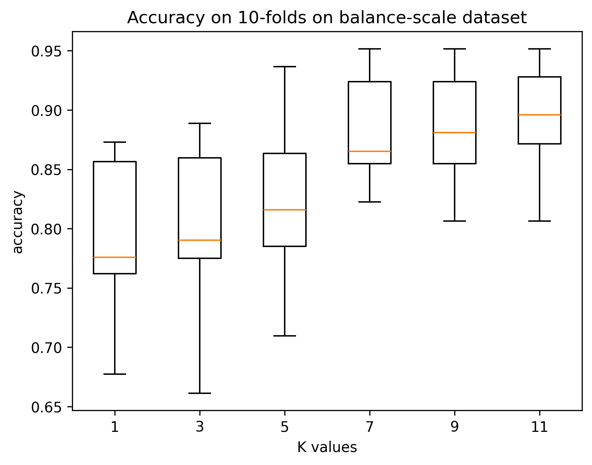

# kTLNN-Python
This is python implemetation of the Two-Layer Nearest Neighbor classifier proposed by [Wang et al.](https://www.sciencedirect.com/science/article/abs/pii/S0950705121008662)

## Classifier description
The operation of the classifier is divided into three stages, given a query point $x$:
1. The first layers is built by the $k$ nearest neighbors of $x$. Then the second layer is formed by the $k$ nearest neighbors of each point in the first layer.
2. Considering the distribution of the query with the second layer points, the extended neighborhood is built with the most salient points in the first and second layer.
3. The final neighborhood is formed by the points in the extended neighbothood which contain $x$ among ther $k_b$ nearest neighbors (backward nearest neighbor relation). The final votation to decide the $x$ class is performed on this neighborhood.

## Instalation
Clone this repository
```bash
git clone git@github.com:daniel-lima-lopez/kTLNN-Python.git
```
move to instalation directory:
```bash
cd kTLNN-Python
```
## Basic usage
Import the class and instantiate the classifier
```python
import TLNN as tl
classifier = tl.kTLNN(k=5, kb_factor=1.4)
```
where:
- `k` is the number of neighboors considerd in the construction of layers.
- `kb_factor` is the $c$ factor to calculate the $k_b$ parameter, calculated as $k_b=c\cdot k$. By default this parameter has value $1.4$, as suggested by the authors.

Once instantiated the classifier, we can perform a simple test:
```python
import pandas as pd
from sklearn.model_selection import train_test_split
from sklearn.metrics import accuracy_score

# data preparation
dataset = pd.read_csv('Datasets/iris.csv')
X = dataset.drop('class', axis=1).values
y = dataset['class'].values

# data split
X_train, X_test, y_train, y_test = train_test_split(X, y, test_size=0.2, random_state=0)

# fit the classifier
classifier.fit(X_train, y_train)

# predictions
preds = classifier.predict(X_test)
print(f'accuracy: {accuracy_score(y_true=y_test, y_pred=preds)}')

```

## Experiments
Experiments were performed with the datasets: balance-scale, bands and wine. On each experiments, a 10-fold cross validation was applied considering the `k` values 1, 3, 5, 7, 9 and 11. The accuracy on each experiment is presented in the following figures:



